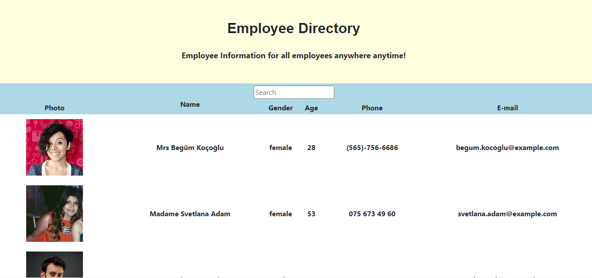

# Employee-Online-Yellowbook

## Description
* This app utilizes an API to populate random users and then create a directory. Users on the app can search for employees by "name" and also sort by name in ascending order.


## Table of Contents

* [Installation](#installation)
* [Usage](#usage)
    * [Screenshots](#screenshots)
    * [Snippets](#snippets)
    * [Technologies](#Technologies)


## Installation

1. Clone repository. 
2. npm start.
3. Open http://localhost:3000 to view it in the browser.
4. The page will reload if you make edits. You will also see any lint errors in the console.

* [See Deployed Site](https://nuchana.github.io/Employee-Online-Yellowbook/)


## Usage

### Screeshots

Homepage displaying employee directory




### Snippets

* Navbar is a class component handling searchTerm and filteredEmployees. Using setState from React to handle an event of input change by using filter method.

```react

      handleInputChange = event => {
        this.setState({
            searchTerm: event.target.value
        });
        let userTyped = event.target.value;
        const filteredList = this.props.employees.filter((item) => {
            let values = item.name.title + item.name.first + item.name.last + item.gender + item.dob.age + item.email + item.cell;
            return values.indexOf(userTyped) !== -1;

        });

        this.setState({
            filteredEmployees: filteredList

        });
    }
    
```

### Technologies used
* [React](https://reactjs.org/docs/getting-started.html)
* [React-DOM](https://reactjs.org/docs/react-dom.html)
* [HTML](https://developer.mozilla.org/en-US/docs/Web/HTML)
* [CSS](https://developer.mozilla.org/en-US/docs/Web/CSS)
* [Bootstrap](https://getbootstrap.com/)
* [Javascript](https://www.javascript.com/)

